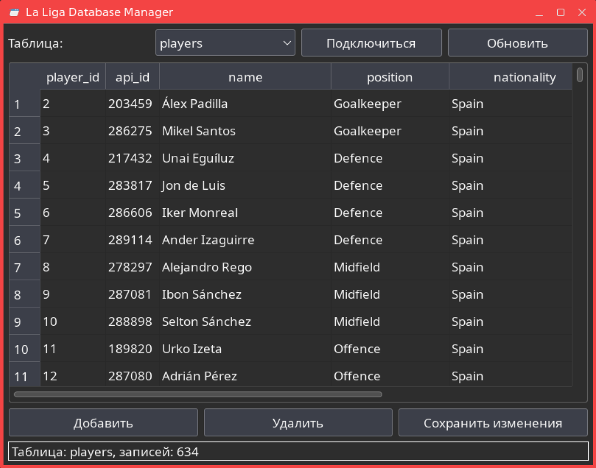
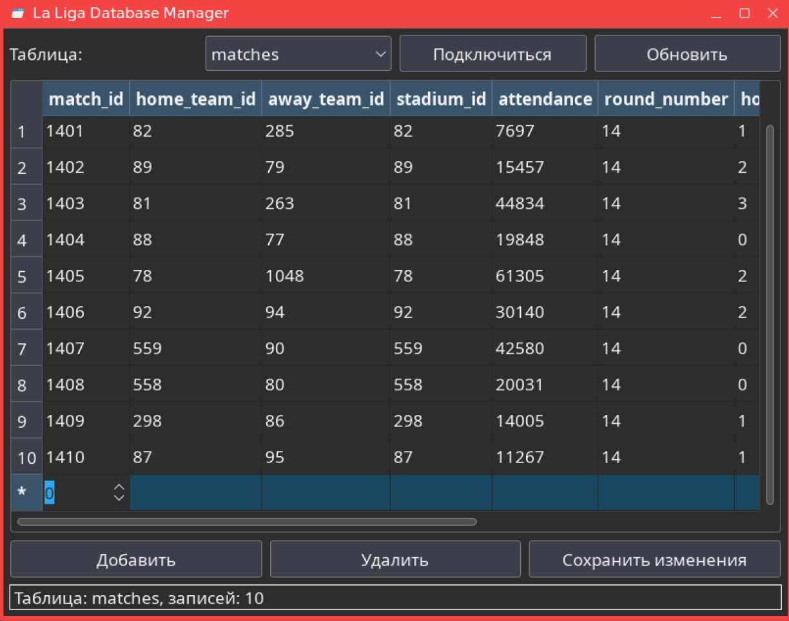

# Описание проекта LaLiga_QT

## Описание проекта

Проект `la_liga_db` представляет собой десктопное приложение, разработанное с использованием фреймворка Qt для управления базой данных чемпионата Испании по футболу (La Liga). Приложение предоставляет графический интерфейс пользователя (GUI) для взаимодействия с базой данных PostgreSQL, позволяя просматривать, добавлять, редактировать и удалять данные о командах, игроках, матчах и статистике.

Основные функции приложения:
- Подключение к базе данных PostgreSQL.
- Отображение таблиц базы данных в табличном виде.
- Добавление, удаление и редактирование записей.
- Обновление данных в реальном времени.  

## Структура проекта

### Основные файлы:
- **LaLiga.pro**: Файл проекта Qt, содержащий конфигурацию сборки. Включает зависимости от модулей Qt (core, gui, sql, widgets), конфигурацию C++11, список исходных файлов (main.cpp, mainwindow.cpp), заголовочных файлов (mainwindow.h) и форм (mainwindow.ui). Этот файл используется qmake для генерации Makefile.
- **main.cpp**:  Содержит функцию main(), которая создает экземпляр QApplication, инициализирует главное окно MainWindow и запускает цикл событий Qt.
- **mainwindow.h**: Заголовочный файл класса MainWindow. Определяет интерфейс главного окна, наследуемого от QMainWindow. Включает объявления слотов для обработки сигналов (connectToDatabase, onTablesComboBoxChanged и др.) и указатели на объекты Qt.
- **mainwindow.cpp**: Реализация класса MainWindow. Содержит конструктор и деструктор, а также реализации слотов для подключения к БД, выбора таблиц, CRUD-операций. Включает логику создания модели данных, настройки таблицы, обработки ошибок и взаимодействия с PostgreSQL через QSqlDatabase и QSqlTableModel.
- **mainwindow.ui**: Файл интерфейса пользователя в формате XML, созданный в Qt Designer. Описывает layout главного окна: вертикальный layout с верхней панелью (combobox для таблиц, кнопки "Подключиться" и "Обновить"), центральной областью (QTableView) и нижней панелью (кнопки CRUD и QLabel для статуса).

### Дополнительные файлы:
- **Makefile.txt**: Файл для сборки проекта с использованием make. Содержит правила компиляции и линковки, генерируемые qmake на основе LaLiga.pro.

### Компоненты GUI:
- **Верхняя панель**: Выпадающий список для выбора таблицы, кнопки "Подключиться" и "Обновить".
- **Центральная область**: Таблица для отображения данных.
- **Нижняя панель**: Кнопки для CRUD-операций (Добавить, Удалить, Сохранить изменения) и строка состояния.

### Подключение к базе данных:
- Используется драйвер QPSQL для PostgreSQL.
- Параметры подключения: localhost, база данных "la_liga", пользователь "postgres".
- При успешном подключении активируются все элементы управления.

### Функциональность:
- **Навигация по таблицам**: Автоматическое заполнение списка таблиц из БД.
- **CRUD-операции**: Добавление новых записей, удаление выбранных, сохранение изменений.
- **Обработка ошибок**: Вывод сообщений об ошибках подключения или операций с данными.

Пример добавления нового матча в базу данных.  

  

Проект демонстрирует интеграцию Qt с базами данных и предоставляет удобный интерфейс для управления данными 